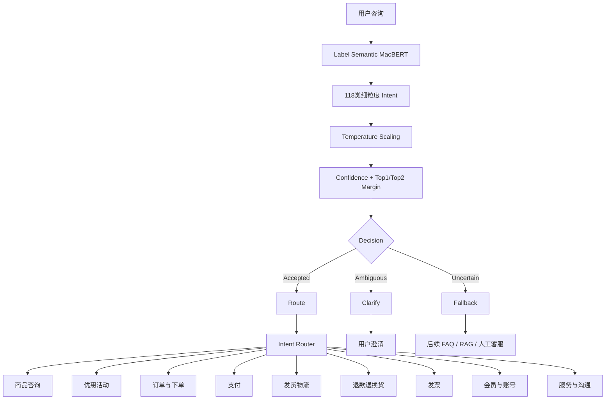

# 中文电商客服细粒度意图识别系统

基于 **Label Semantic MacBERT** 的中文电商客服细粒度意图识别系统。

项目围绕真实电商客服场景，完成从数据分析、Baseline、深度学习、预训练模型、数据质量治理、标签语义增强、错误分析、置信度校准、拒识机制到业务路由和可视化 Demo 的完整 NLP 工程流程。

当前系统支持 **118 类细粒度电商客服意图识别**，并进一步将细粒度 Intent 映射至商品、订单、物流、售后等业务域。

---

## 1. 项目效果

### Independent Test

| Metric | Result |
|---|---:|
| Samples | 2000 |
| Accuracy | **82.05%** |
| Macro-F1 | **76.45%** |

### Selective Prediction

系统结合校准后的 Softmax Confidence 与 Top1-Top2 Margin，将预测划分为：

- `accepted`：高置信度，可进入业务路由
- `ambiguous`：Top1 / Top2 接近，需要澄清
- `uncertain`：整体置信度不足，进入 fallback

Independent Test 上：

| Status | Coverage | Accuracy |
|---|---:|---:|
| accepted | **57.25%** | **94.85%** |
| uncertain | 23.05% | 82.00% |
| ambiguous | 19.70% | 44.92% |

Accepted 样本 Macro-F1 为 **91.60%**。

---

## 2. 系统架构

```text
                      User Query
                           │
                           ▼
                ┌─────────────────────┐
                │ IntentClassifier    │
                │ Label Semantic      │
                │ MacBERT             │
                └──────────┬──────────┘
                           │
                           ▼
                 118-class Intent
                           │
                           ▼
                Temperature Scaling
                           │
                           ▼
                 Confidence + Margin
                           │
             ┌─────────────┼─────────────┐
             ▼             ▼             ▼
         accepted       ambiguous     uncertain
             │             │             │
             ▼             ▼             ▼
           route         clarify       fallback
             │
             ▼
                ┌─────────────────────┐
                │    Intent Router    │
                └──────────┬──────────┘
                           │
                           ▼
                 Business Domain
                           │
       ┌───────────────────┼────────────────────┐
       ▼                   ▼                    ▼
     商品咨询            发货物流             退款售后
     优惠活动            订单下单             支付
     发票                会员账号             服务沟通
                           │
                           ▼
                 Business Handler
```

当前项目聚焦于 **Intent Classification + Decision + Routing**。

FAQ、RAG 和真实业务 API 暂未接入。

---

## 3. 模型演进

项目没有直接使用单一 BERT 模型，而是按照由简单到复杂的方式逐步建立 Baseline 并进行优化。

| Model | Accuracy | Macro-F1 | Dataset |
|---|---:|---:|---|
| TF-IDF + Logistic Regression | 62.40% | 43.33% | Dev |
| TextCNN | 62.75% | 47.59% | Dev |
| MacBERT | 66.65% | 49.77% | Dev |
| Weighted MacBERT (Raw) | 64.10% | 50.76% | Dev |
| Weighted MacBERT (Clean) | 64.20% | 51.69% | Dev |
| **Label Semantic MacBERT** | **65.90%** | **52.92%** | Dev |
| **Label Semantic MacBERT** | **82.05%** | **76.45%** | Independent Test |

> Dev 与 Test 存在明显性能差异，可能与数据难度和分布差异有关，因此项目分别报告两套结果，不将其直接视为同分布性能提升。

---

## 4. 数据质量治理

数据分析过程中发现：

- 类别长尾分布
- 强标签噪声
- 局部类别污染
- 细粒度 Intent 边界重叠
- 多意图文本与单标签任务之间的冲突

### OOF Noise Detection

使用：

```text
5-Fold Stratified OOF
        ↓
Character TF-IDF
        ↓
Logistic Regression
        ↓
预测概率分析
```

强噪声候选筛选条件：

```python
pred_prob >= 0.70
true_prob <= 0.10
prob_gap >= 0.60
```

从 10,000 条 Train 数据中筛选出：

```text
112 条强标签噪声候选
```

经人工 Review 后对 112 条标签进行了修正，生成：

```text
data/processed/train_clean.csv
```

---

## 5. Label Semantic MacBERT

传统分类器将 Label 作为离散 ID：

```text
Text
 ↓
MacBERT
 ↓
Linear
 ↓
118 Classes
```

本项目进一步利用数据集中的 `label_des`：

```text
Text ───────→ MacBERT ───────→ Text Embedding
                  │
Label Description ┘
                  ↓
           Label Embedding
                  ↓
          Cosine Similarity
```

训练目标：

```text
L =
Weighted Classification CE
+
0.2 × Semantic CE
```

使模型不仅学习：

```text
文本 → Label ID
```

同时学习：

```text
文本语义 ↔ Intent 标签语义
```

---

## 6. Hard Negative Experiment

错误分析发现：

```text
买家要求修改收件信息
↔
买家表示收件信息不需要修改了
```

Label Semantic 模型出现明显语义塌缩。

因此设计 Targeted Hard Negative Loss：

```text
L_hard =
max(
    0,
    margin
    - positive_score
    + negative_score
)
```

实验后该类别对混淆：

```text
20 → 2
```

但同时出现其他类别边界漂移。

最终结果：

| Model | Accuracy | Macro-F1 |
|---|---:|---:|
| Label Semantic | 65.90% | 52.92% |
| + Hard Negative | 65.45% | 53.05% |

因此 Hard Negative 被保留为 **Ablation Experiment**，最终主模型仍采用 Label Semantic MacBERT。

---

## 7. Probability Calibration

使用 Temperature Scaling 对分类 Logits 进行校准：

```text
T = 0.9185
```

校准前：

```text
NLL = 2.1359
ECE = 0.2001
```

校准后：

```text
NLL = 2.1054
ECE = 0.1546
```

Temperature Scaling 不改变分类结果，只改善 Confidence 的可解释性。

---

## 8. Reject Policy

最终决策规则：

```python
if confidence >= 0.50:
    status = "accepted"

elif margin < 0.15:
    status = "ambiguous"

else:
    status = "uncertain"
```

其中：

```text
margin = Top1 Probability - Top2 Probability
```

系统因此不仅输出：

```text
Intent = 买家咨询物流信息
```

还可以输出：

```text
Intent      : 买家咨询物流信息
Confidence  : 0.72
Margin      : 0.51
Status      : accepted
Action      : route
```

---

## 9. Intent Router

118 个细粒度 Intent 进一步映射至业务域：

```text
PRODUCT       商品咨询
PROMOTION     优惠活动
ORDER         订单与下单
PAYMENT       支付
SHIPPING      发货物流
AFTER_SALES   退款退换货
INVOICE       发票
MEMBER        会员与账号
SERVICE       服务与沟通
OTHER         其他
```

例如：

```text
用户：
退款什么时候到账

        ↓

Fine-grained Intent：
买家咨询退款时间

        ↓

Business Domain：
退款退换货

        ↓

Status：
accepted

        ↓

Action：
route
```

---

## 10. 项目结构

```text
customer_intent_classification/
│
├── app.py
│
├── data/
│   ├── raw/
│   ├── interim/
│   └── processed/
│
├── models/
│   └── bert/
│
├── src/
│   ├── config.py
│   │
│   ├── data_process/
│   │   ├── data_loader.py
│   │   ├── data_analysis.py
│   │   ├── data_cleaner.py
│   │   ├── oof_noise_detector.py
│   │   ├── review_noise_candidates.py
│   │   └── build_clean_train.py
│   │
│   ├── dataset/
│   │   ├── text_dataset.py
│   │   └── macbert_dataset.py
│   │
│   ├── models/
│   │   ├── tfidf_lr.py
│   │   ├── textcnn.py
│   │   └── label_semantic_macbert.py
│   │
│   ├── training/
│   │   ├── train_textcnn.py
│   │   ├── train_macbert.py
│   │   ├── train_label_semantic_macbert.py
│   │   └── train_label_semantic_hard_negative.py
│   │
│   ├── evaluation/
│   │   ├── analyze_macbert_errors.py
│   │   ├── analyze_intent_confusion.py
│   │   ├── analyze_confidence.py
│   │   ├── calibrate_temperature.py
│   │   └── evaluate_test.py
│   │
│   ├── inference/
│   │   └── intent_classifier.py
│   │
│   ├── router/
│   │   └── intent_router.py
│   │
│   └── handlers/
│       └── customer_service_handler.py
│
├── requirements.txt
├── README.md
└── .gitignore
```

---

## 11. Quick Start

### 安装依赖

```bash
pip install -r requirements.txt
```

### 启动 Demo

在项目根目录执行：

```bash
streamlit run app.py
```

### 模型推理测试

```bash
python -m src.inference.intent_classifier
```

### Intent Router 测试

```bash
python -m src.router.intent_router
```

### Independent Test Evaluation

```bash
python -m src.evaluation.evaluate_test
```

---

## 12. Demo

### Chat Interface

> 在此放置 Demo 截图

```text
docs/images/demo_chat.png
```

Demo 左侧提供客服聊天界面，右侧实时展示：

- Fine-grained Intent
- Business Domain
- Confidence
- Top1-Top2 Margin
- Accepted / Ambiguous / Uncertain
- Top-K Intent Prediction

---

## 13. Tech Stack

```text
Python
PyTorch
Transformers
MacBERT
scikit-learn
pandas
NumPy
Streamlit
```

---

## 14. Future Work

当前项目已经完成 Intent Classification 与 Intent Routing。

后续可以进一步扩展：

```text
Intent Classification
        ↓
Intent Router
        ↓
FAQ Retrieval
        ↓
RAG
        ↓
LLM Response Generation
        ↓
Business API / Human Handoff
```


## 15.System Architecture

